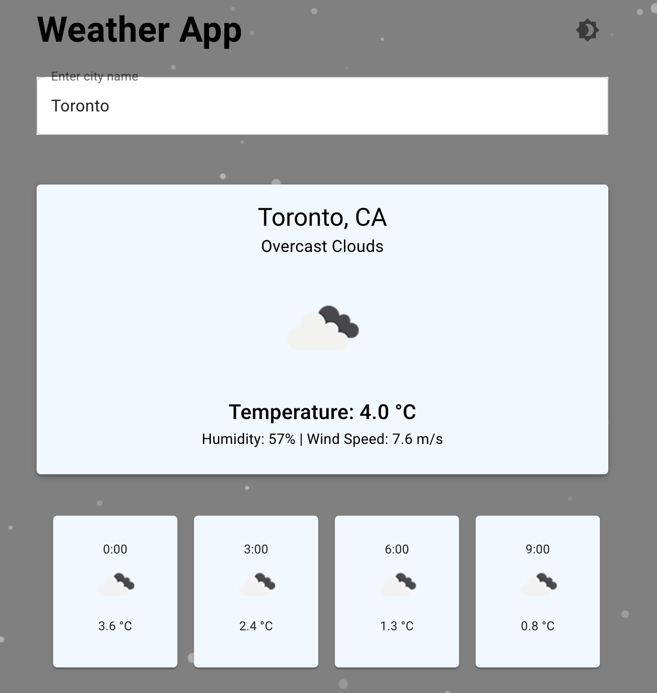
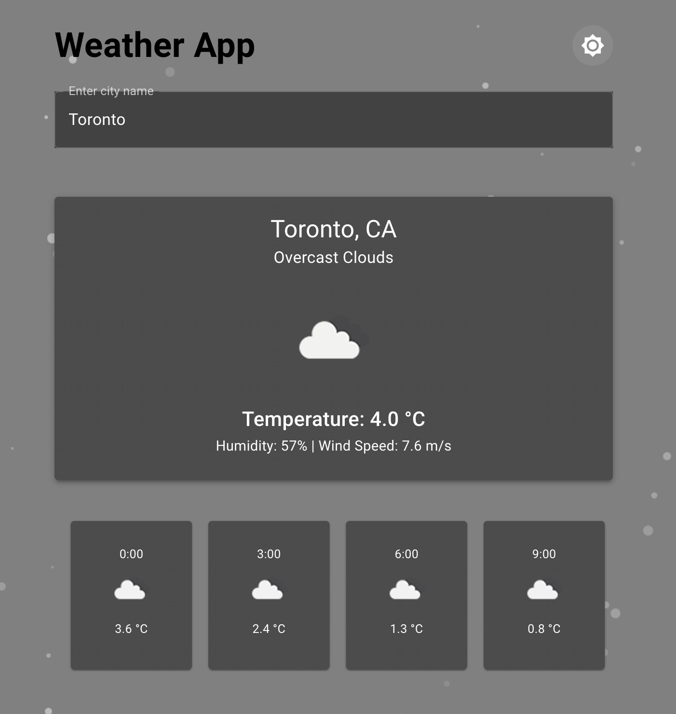
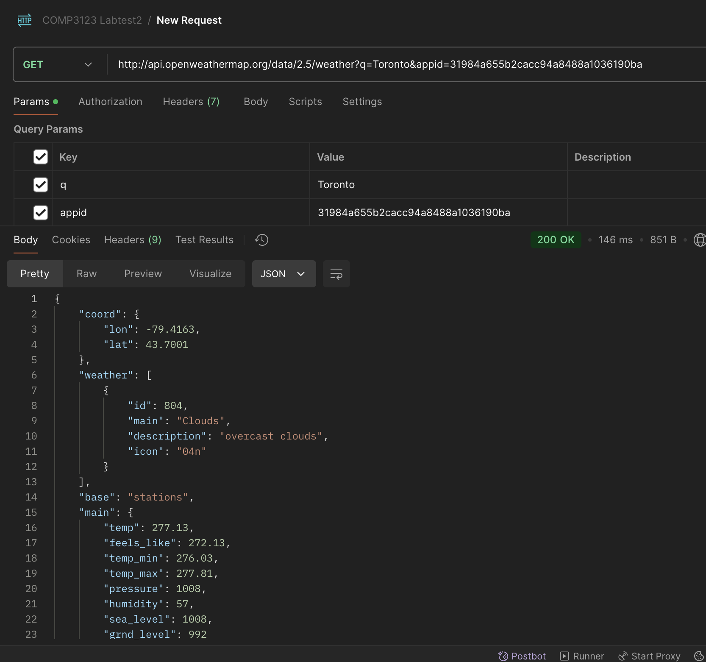

# 🌟 Weather App with Interactive Particle Background

## 📝 Description

This modern and feature-rich weather application is built with ReactJS. It provides:

    - Real-time weather data for cities worldwide.
    - Interactive particle background that reacts to mouse movements and clicks.
    - Dynamic Light/Dark mode toggle for personalized themes.
    - Hourly forecasts with scrollable, responsive UI.

## 🚀 Features

    - Dynamic Particle Background: Interactive particles that move and react to user interactions.
    - Weather Cards with Transitions: Displays current weather conditions with smooth animations.
    - Hourly Forecasts: A scrollable section showing the next 12 hours of weather data.
    - Light/Dark Mode: Toggle themes for better visibility and user preference.
    - Error Handling: Displays error messages for invalid city inputs.

## Screenshots

